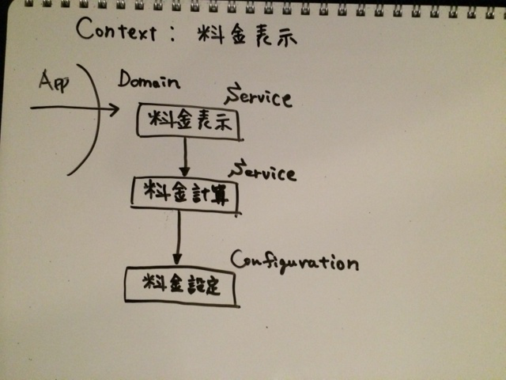

式言語を使ったミニサンプルコード
================


Symfony/Expression Language コンポーネントを使った設定式のサンプル。

- [Expression Language component 公式マニュアル](http://symfony.com/doc/current/components/expression_language/index.html)
- [ExpressionLanguage コンポーネント マニュアル日本語訳](http://docs.symfony.gr.jp/symfony2/components/expression_language/introduction.html)
- [symfony/expression-language](https://github.com/symfony/expression-language)


下記ブログを拝読して考えたみたものです。

[リファクタリングのエッセンス | GuildWorks Blog](http://blog.guildworks.jp/2014/09/09/%E3%82%B3%E3%83%BC%E3%83%89%E3%81%AE%E8%A8%AD%E8%A8%88%E6%94%B9%E5%96%84%E3%81%AE%E3%82%A8%E3%83%83%E3%82%BB%E3%83%B3%E3%82%B9/)


## お題の説明

- 価格が季節に連動するようなサービスを売っているとする。（避暑地とか、スキー場とか、ガス料金とか？）
- 季節（夏かそれ以外の季節か）によって料金の算出ルールが異なる。


## 可変点

- 変わりやすいビジネスポリシー
  - 料金の計算式
    - 式自体や、式中の固定値の値は可変
  - 夏の定義
    - 何月何日から何日までを夏料金にするのか？は可変


## 共通点

- 料金は季節に応じた計算ルールによって求まる


## ルール

| 季節  | 期間        | 料金 |
|:----|:-----------:|:-----|
| 夏               | 7月〜8月 |(基本料金) x (夏レート) |
| 夏以外（デフォルト）| それ以外の季節 | (基本料金) x (デフォルトレート) + (デフォルト固定料金) |


## 季節別設定式

[季節別設定式](https://github.com/kumamidori/Sample.ExpressionLanguage/blob/master/app/config/charge.yml)

```
  default:
    span: (date >= 0101 and date < 0701) or date >= 0901
    formula: base * 1.2 + 1000
  summer:
    span: date >= 0701 and date < 0901
    formula: base * 0.9
```

## モデル


